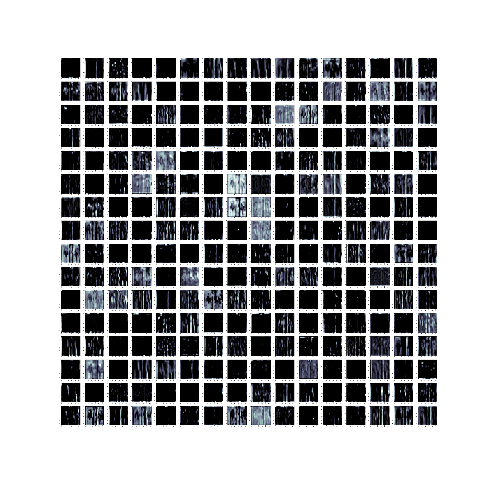
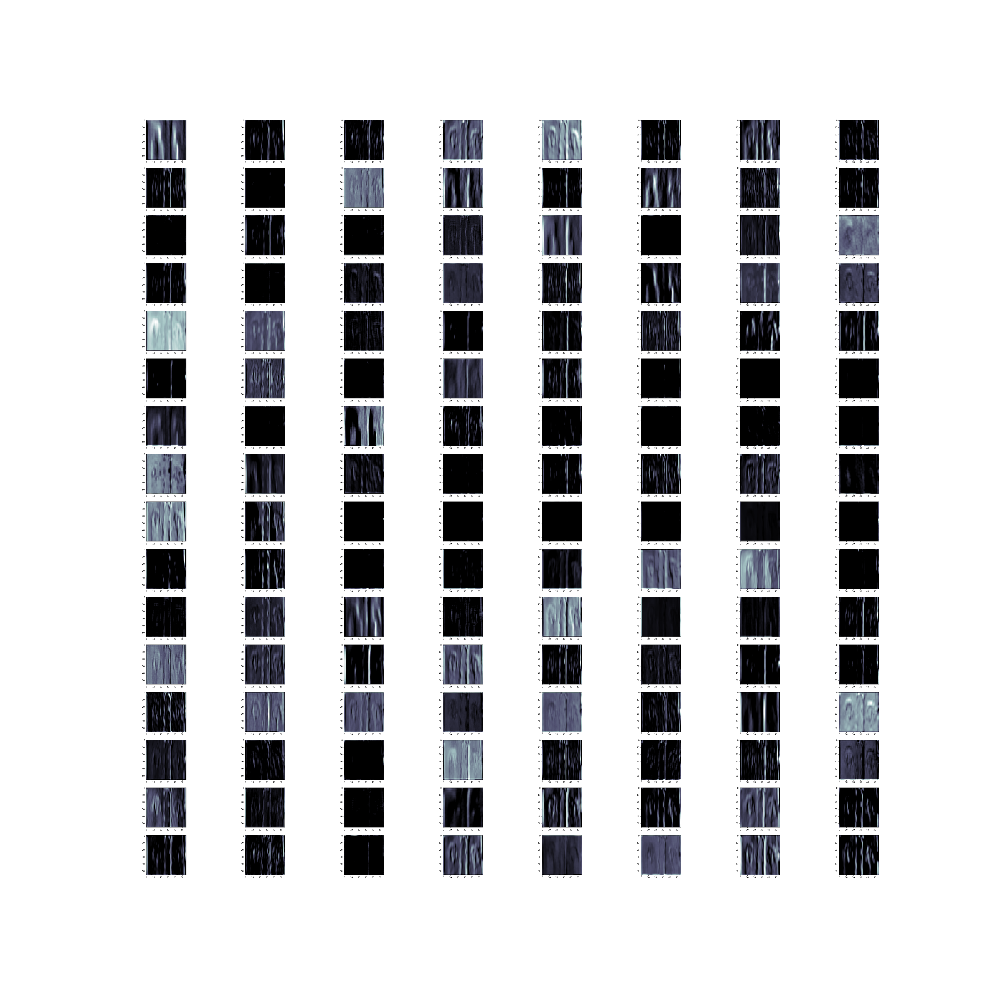
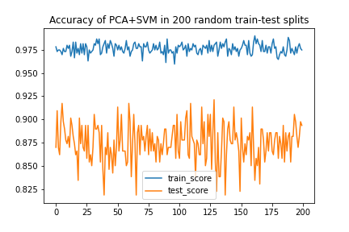
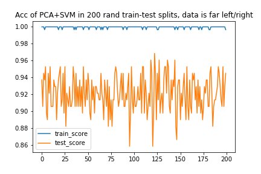
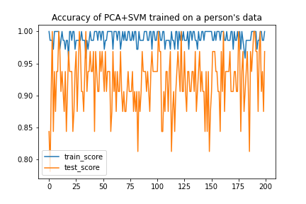
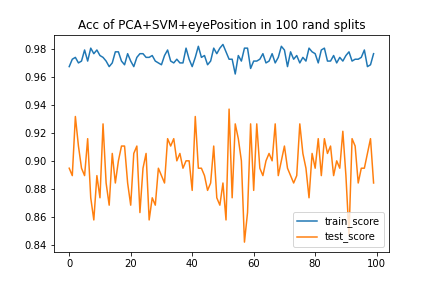
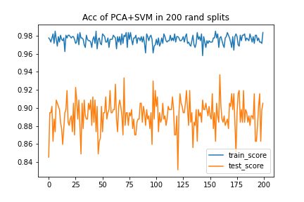
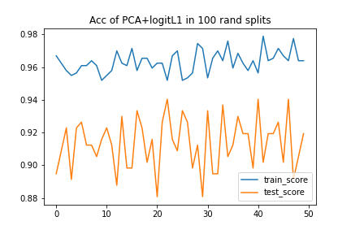
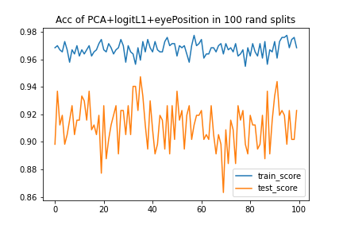

# Experiment results of various classical ML models

## 1. Features from 3rd max pool in VGG16


```
Model: "model_4"
_________________________________________________________________
Layer (type)                 Output Shape              Param #   
=================================================================
input_1 (InputLayer)         (None, None, None, 3)     0         
_________________________________________________________________
block1_conv1 (**Conv2D**)        (None, None, None, 64)    1792      
_________________________________________________________________
block1_conv2 (Conv2D)        (None, None, None, 64)    36928     
_________________________________________________________________
block1_pool (MaxPooling2D)   (None, None, None, 64)    0         
_________________________________________________________________
block2_conv1 (Conv2D)        (None, None, None, 128)   73856     
_________________________________________________________________
block2_conv2 (Conv2D)        (None, None, None, 128)   147584    
_________________________________________________________________
block2_pool (MaxPooling2D)   (None, None, None, 128)   0         
_________________________________________________________________
block3_conv1 (Conv2D)        (None, None, None, 256)   295168    
_________________________________________________________________
block3_conv2 (Conv2D)        (None, None, None, 256)   590080    
_________________________________________________________________
block3_conv3 (Conv2D)        (None, None, None, 256)   590080    
_________________________________________________________________
block3_pool (MaxPooling2D)   (None, None, None, 256)   0         
=================================================================
Total params: 1,735,488
Trainable params: 1,735,488
Non-trainable params: 0
_________________________________________________________________
```

### 256 features after passing a image through the 3rd max pooling



Extract the features from the 3rd layer and reshape to (None,200704) to feed into a SVM

### Binary classification

SVM binary Accuracy (train): 0.6277695716395865

SVM binary Accuracy (test): 0.863905325443787


### Quaternary classification

SVM Accuracy test: 0.621301775147929


## 2. Features from 2nd max pool in VGG16

```
Model: "model_1"
_________________________________________________________________
Layer (type)                 Output Shape              Param #   
=================================================================
input_1 (InputLayer)         (None, None, None, 3)     0         
_________________________________________________________________
block1_conv1 (Conv2D)        (None, None, None, 64)    1792      
_________________________________________________________________
block1_conv2 (Conv2D)        (None, None, None, 64)    36928     
_________________________________________________________________
block1_pool (MaxPooling2D)   (None, None, None, 64)    0         
_________________________________________________________________
block2_conv1 (Conv2D)        (None, None, None, 128)   73856     
_________________________________________________________________
block2_conv2 (Conv2D)        (None, None, None, 128)   147584    
_________________________________________________________________
block2_pool (MaxPooling2D)   (None, None, None, 128)   0         
=================================================================
Total params: 260,160
Trainable params: 260,160
Non-trainable params: 0
_________________________________________________________________
```

### 64 features after passing a image through the 3rd max pooling




Extract the features from the 2nd layer and reshape to (None, 401408) to feed into a SVM

### Binary classification

SVM binary train Accuracy: 0.9409158050221565

SVM binary test Accuracy: 0.8816568047337278


### Quaternary classification

SVM train quaternary Accuracy: 0.7872968980797637

SVM test Accuracy: 0.5976331360946746


## 3. Features from PCA


### Binary classification 1

Actually takes longer to predict SVD is harder to be performed

We need to do another grid search
```
CPU times: user 1h 17min 8s, sys: 5min 22s, total: 1h 22min 30s
Wall time: 21min 14s
{'svc__C': 1, 'svc__gamma': 0.0001}
```
where we get this from grid `svc__C:[1, 5, 10, 50], svc__gamma: [0.0001, 0.0005, 0.001, 0.005]`

Testing:

```
                precision    recall  f1-score   support

           0       0.88      0.84      0.86        89
           1       0.83      0.88      0.85        80

    accuracy                           0.86       169
   macro avg       0.86      0.86      0.86       169
weighted avg       0.86      0.86      0.86       169
```


### Binary classification 2

After another grid search, we have a better model:

```
CPU times: user 1h 13min 26s, sys: 5min 7s, total: 1h 18min 33s
Wall time: 21min 21s
{'svc__C': 0.05, 'svc__gamma': 0.0001}
```

where we get this from grid `svc__C:[1, 0.5, 0.1, 0.05], svc__gamma: [0.0001, 0.00005, 0.00001, 0.000005]`

Testing:

```
               precision    recall  f1-score   support

           0       0.87      0.90      0.88        81
           1       0.91      0.88      0.89        88

    accuracy                           0.89       169
   macro avg       0.89      0.89      0.89       169
weighted avg       0.89      0.89      0.89       169
```

### Binary classification 2

Now we feed the original image size (25,50) into the SVM, n_components=300

Training accuracy:

```
               precision    recall  f1-score   support

           0       0.98      0.99      0.98       328
           1       0.99      0.98      0.99       349

    accuracy                           0.99       677
   macro avg       0.99      0.99      0.99       677
weighted avg       0.99      0.99      0.99       677
```


Testing accuracy:

```
               precision    recall  f1-score   support

           0       0.91      0.86      0.89        94
           1       0.84      0.89      0.86        75

    accuracy                           0.88       169
   macro avg       0.87      0.88      0.87       169
weighted avg       0.88      0.88      0.88       169
```


## 4. Verifying the stability of the PCA+SVM model

```{python}
pca = PCA(n_components=150, whiten=True, random_state=42)
svc = SVC(kernel='linear', C=0.05)
```



```
                  mean       std
train_score    0.976318    0.005519
test_score     0.876260    0.020383
```

## 5. Use extreme training and testing data




```
                  mean       std
train_score    0.999492    0.001213
test_score     0.920197    0.022098
```


## 6. Use a person's data



PCA has 36 components in this situation because the data set is small! `n_components<=min(n_samples, n_features)` 

```python
pca = PCA(n_components=36, whiten=True, random_state=42)
svc = SVC(kernel='linear', C=0.05)
```


```
                  mean       std
train_score    0.990694    0.010051
test_score     0.921406    0.043181
```


## 7. Add left/right eye positions as input

We did not scale the input as all parameters falls between [-1,1]

```python
pca = PCA(n_components=125, whiten=True)
svc = SVC(kernel='linear', C=0.1)

# prepare the input training data
pca.fit(eyeImage_train)
eyeImage_train = pca.transform(eyeImage_train)
input_train = np.concatenate((eyeImage_train, leftEye_train, rightEye_train), axis=1)
scalar.fit(input_train)
input_train = scalar.transform(input_train)
```



                  	mean       std
    train_score    0.973553    0.004226
    test_score     0.895474 	 0.019262
* Improvement in the test score comparing to the vallina model may be due to the incresing size of the dataset

Use the same hyper parameters to test on the vallina model:



              				mean       std
    train_score    0.975571    0.005017
    test_score     0.892000 	 0.016697
Add left/right eye positions or not does not affect the train/test score too much


## 8. Use PCA+Logistic Regression(L1)



This is the first time that I achieved a mean test score > 0.9. Simplicity matters.

```python
pca = PCA(n_components=125, whiten=True)
logit = LogisticRegression(penalty='l1', solver='saga',C=0.163)
logit_model = make_pipeline(pca, logit)
```

```
                  mean       std
train_score    0.963128    0.006685
test_score     0.913333 	 0.015696
```


## 9. Use PCA+eye position+Logit(L1)



